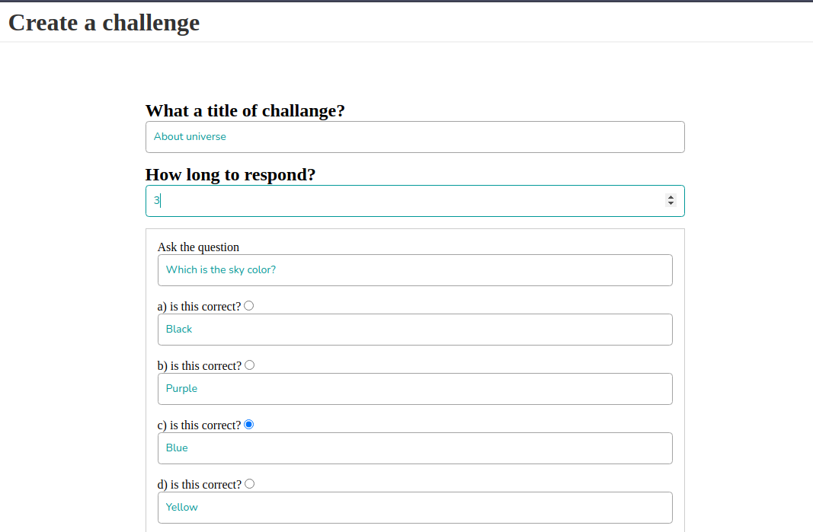
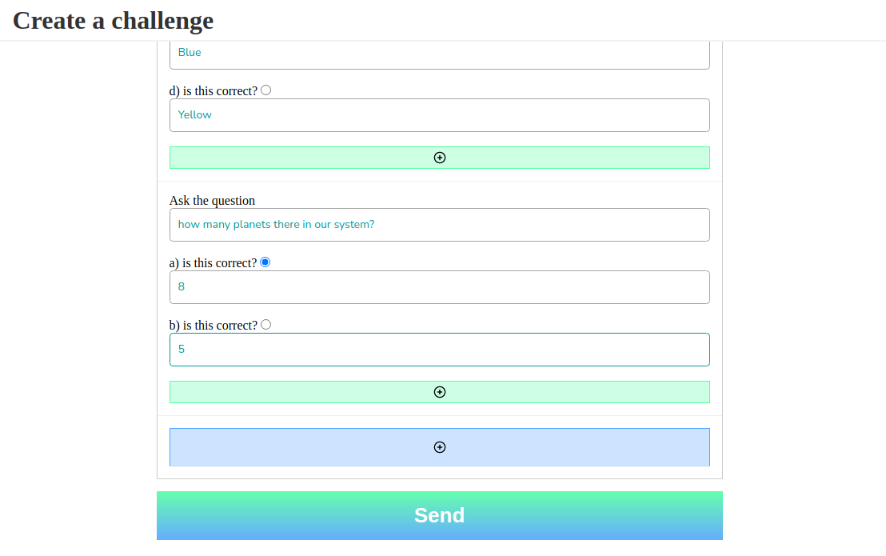
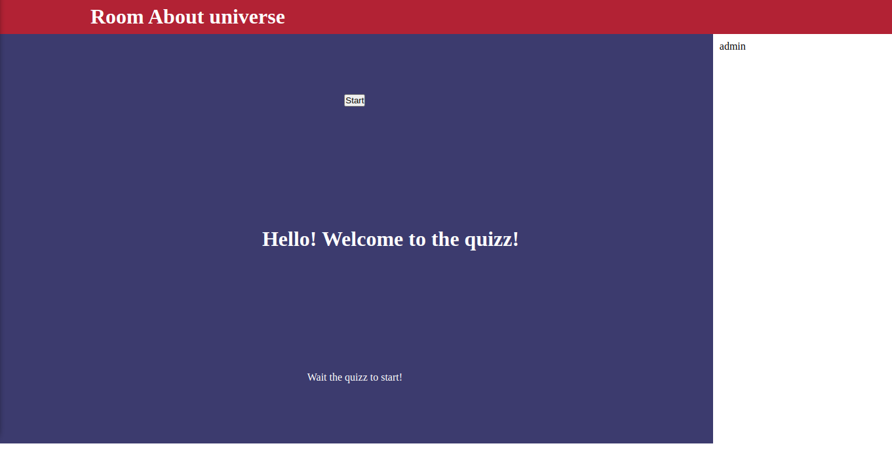

# English quizz

Projeto pensado por alunos de inglês que enxegaram a necessidade do professoar de ter uma ferramenta onde possa montar uma serie de perguntas e suas alternativas e que todos os alunos interajam ao mesmo tempo.

A ideia consistem em, após a criação da sala a partir de um formulário contendo as perguntas e as respostas, os alunos conectem a sala e esperem o quizz começar. Então o dono/professor da sala pode acionar o inicio do quizz. Cada participante receberá a pergunta e suas alternativas previamente configurada.

## Media








## Como rodar o projeto

### Server

instalação das dependências

```bash
# Na pasta server 

$ npm install

# ou

$ yarn
```

execução do servidor

```bash
# development
$ npm run start

# watch mode
$ npm run start:dev

# production mode
$ npm run start:prod
```

ou 

```bash
# development
$ yarn start

# watch mode
$ yarn start:dev

# production mode
$ yarn start:prod
```

execução de testes

```bash
# unit tests
$ npm run test

# e2e tests
$ npm run test:e2e

# test coverage
$ npm run test:cov
```

ou 

```bash
# unit tests
$ yarn test

# e2e tests
$ yarn test:e2e

# test coverage
$ yarn test:cov
```

### Client

instalação das dependências

```bash
# Na pasta server 

$ npm install

# ou

$ yarn
```

execução do client

```bash
# development
$ npm run start

```

ou 

```bash
# development
$ yarn start
```

execução de testes

```bash
# unit tests
$ npm run test
```

ou

```bash
# unit tests
$ yarn test
```